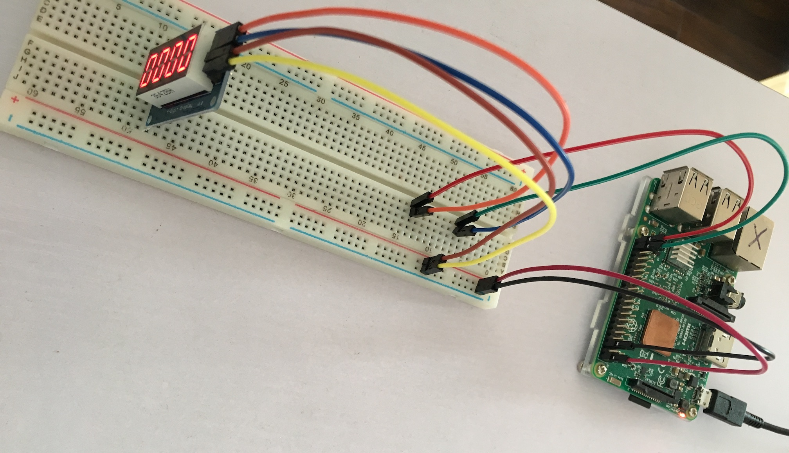

# raspberrypi tm1637 4-digit display

TM1637 4-digit display demo

raspberry pi 3b+

Node.js 8+

## 说明

本demo使用的模式为 `0b01000000`, 即 普通的自动地址增加的写数据到显示寄存器, 具体参照[芯片规格书-TM1637](assert/tm1637_doc)

1. 时钟上升沿读取数据
2. 时钟高电位时, 数据口下降沿表示数据传输开始, 上升沿表示数据传输结束
3. 除开始结束命令外, 其余数据传输均为9个上升沿, 前8个表示8个传输的字节, 8号下降沿后数据接口会产生一个`ack`反馈, 低电平表示传输成功

## 流程

1. 开始 -> 设置传输模式 -> 结束
2. 开始 -> 设置数字起始显示地址 -> 设置一个数字 -> 设置一个数字 -> ... -> 结束
3. 开始 -> 设置显示控制 -> 结束
